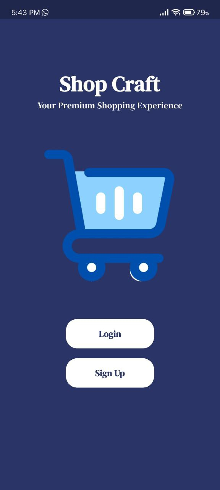
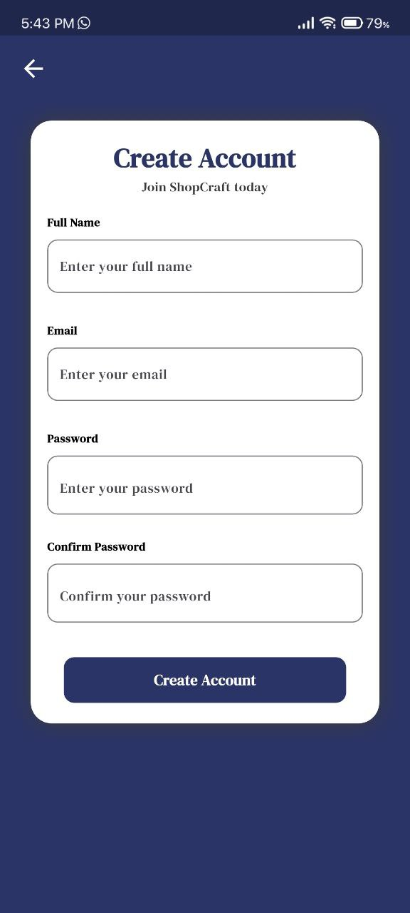
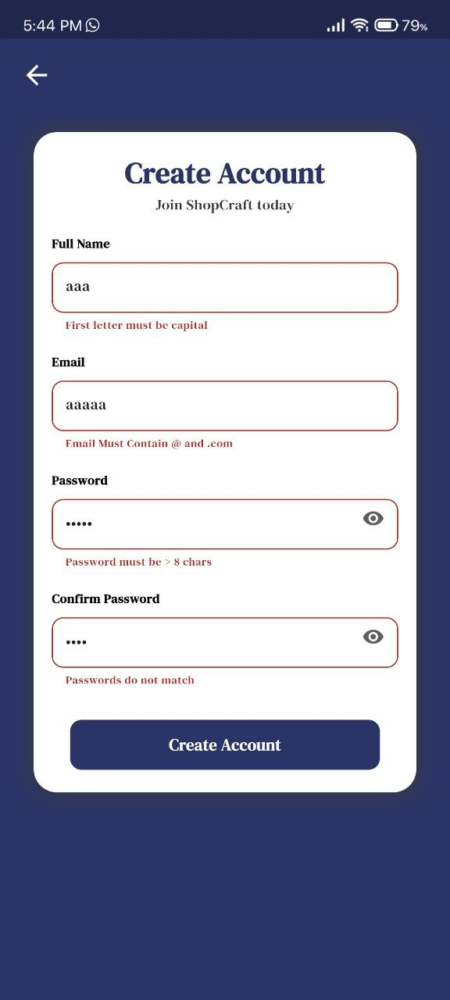
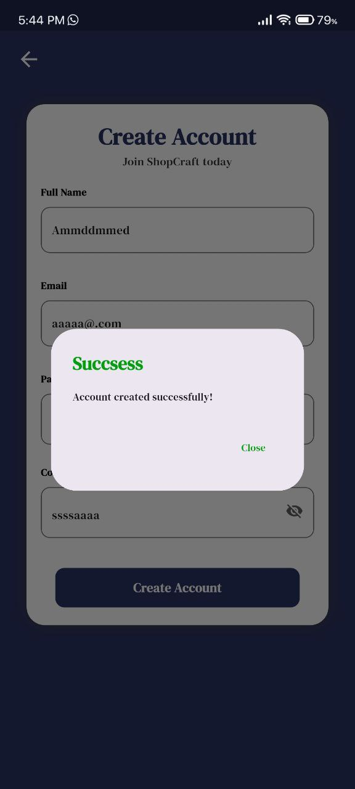
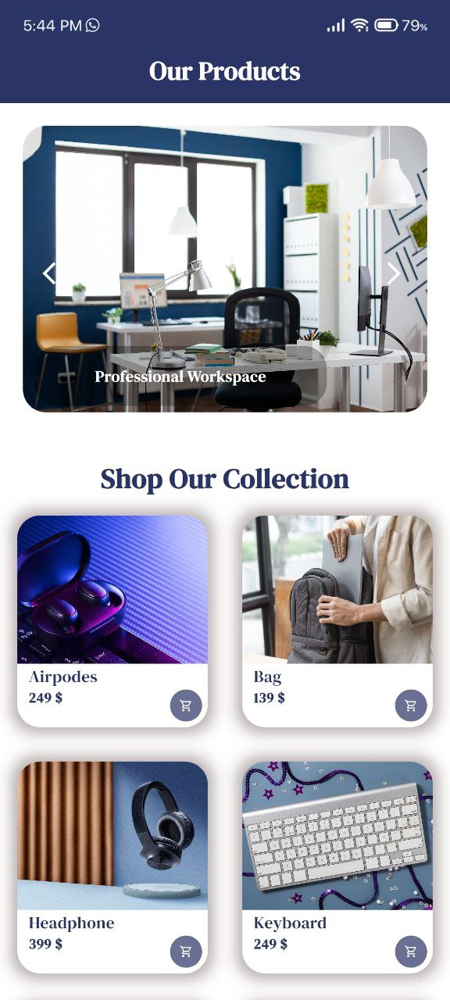
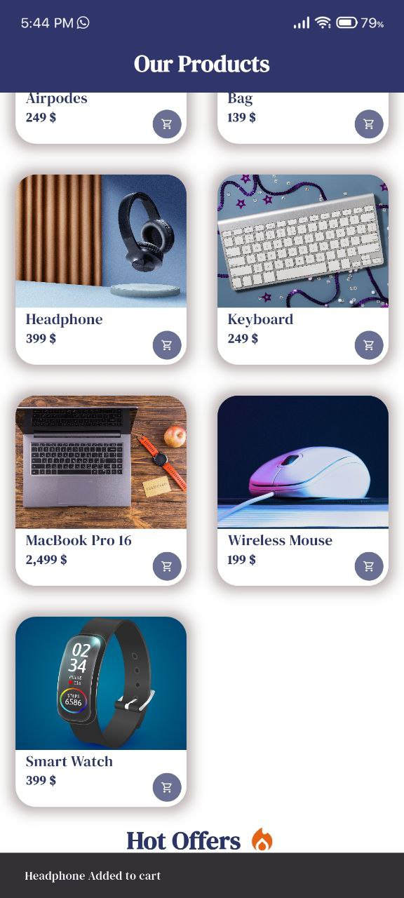

# 🛍️ Flutter ShopCraft App

## 📱 Project Overview
This is a shopping mobile app built using Flutter.  
The app allows users to sign up, log in, browse products, and add new products.  
It simulates a basic e-commerce experience with clean UI and responsive design.

---

## 🚀 Features
- 🔐 User Authentication (Login & Sign Up)
- 🔐 Validation for Authentication (Login & Sign Up)
- 🛒 Product listing in a grid view
- 🛒 slider listing in a page view
- 🛒 Hot offers listing in a page view
- ✨ Responsive and clean UI
- 🧼 Separated widgets and clean code structure

---

## 🛠️ Setup Instructions

1. Make sure you have Flutter installed.  
   Run the following commands in terminal:
      flutter pub get
      flutter run

## 📸 Screenshots

###  Welcome Page

---

### Login Page

---

### Signup Page

---

### validation Page

### successful Page

---

### Home1 Page

---

### Home2 Page

---

### Home3 Page

